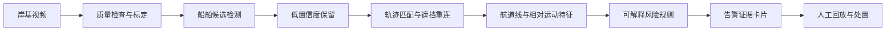
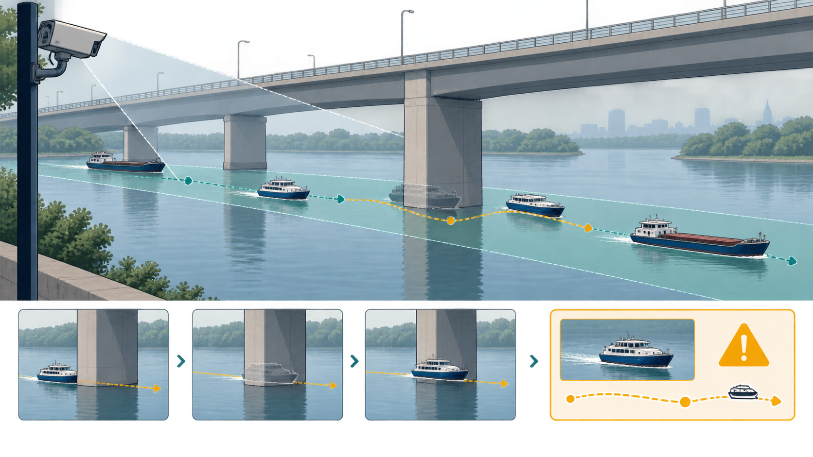

# 桥区视觉感知与风险预警闭环

**文档类型**：竞赛作品说明书 / 研究方案初稿  
**拟定选题**：面向桥区复杂遮挡环境的船舶轨迹重建与通航风险预警方法  
**版本**：v0.1（待实验数据与实地标注补充）  
**写作原则**：已完成内容、拟验证内容和待确认内容分开表述；文中不把计划指标写成实验结论。

## 摘要

桥区水域的安全监管存在一个容易被忽略的断点：摄像机能够“看到”船舶，并不意味着系统能够持续理解船舶的运动。桥墩、桥梁结构和逆光会造成目标短时消失；船舶交会和低能见度又会放大误匹配，使单帧检测结果难以直接支撑风险判断。本项目拟构建一套面向桥区视频的船舶检测、轨迹重建和风险解释系统，把“发现目标—保持身份—判断冲突—回放核验”连成一个可追溯闭环。

方案以轻量化目标检测器为入口，以低置信度候选保留和轨迹级重连为核心，叠加虚拟航道线、速度变化和相对距离规则。研究重点不是宣称一个新的通用检测器，而是回答一个更具体的问题：在桥区遮挡导致观测不连续时，哪些可解释的轨迹证据能够稳定支撑风险预警。项目将用带遮挡标注的视频片段进行分层验证，分别报告检测、身份保持、告警及时性和误报来源；没有真实标注的指标一律不填入成果表。

## 1. 问题与应用边界

交通运输部、应急管理部发布的内河交通安全工作意见要求强化风险分级管控、隐患排查和岸基技术支持。桥区监管通常已经具备视频资源，但值守人员仍需要在多路画面之间确认船舶身份、方向和是否进入风险区域。本项目面向“辅助研判”场景，不替代船员、海事执法人员或现有航行规则；系统输出告警证据和回放片段，由人员作最终处置决定。

本项目的边界有三条：

1. 只处理固定摄像机或可标定的岸基视频，不承诺覆盖所有天气和镜头移动情况。
2. 只报告视频中可观察到的目标、轨迹和规则触发，不从画面臆测船舶载重、驾驶意图或事故责任。
3. 只把经过标注集验证的指标写入最终成果，演示视频中的个案不替代统计评估。

## 2. 科学问题与研究假设

**科学问题**：当桥区遮挡使船舶观测出现短时缺口时，检测置信度、运动连续性和航道规则三类证据如何协同，才能减少身份切换和无效告警？

围绕这一问题提出三个可检验假设：

- H1：保留低置信度候选并与既有轨迹联合匹配，能够降低遮挡后重新分配身份的比例。
- H2：把“进入虚拟航道线”“相对距离收缩”“速度方向突变”拆成可解释规则，能够比单一阈值告警更容易定位误报原因。
- H3：按遮挡程度、光照和船舶密度分层报告，比只给一个总体准确率更能反映系统的真实适用边界。

## 3. 目标与预期贡献

| 目标 | 可交付物 | 验证方式 | 当前状态 |
|---|---|---|---|
| 建立桥区视频数据规范 | 摄像机标定表、目标与遮挡标注说明 | 双人抽检、冲突记录 | 待采集 |
| 实现船舶检测与轨迹管理 | 可运行原型、轨迹日志 | 检测与身份指标分层评估 | 方案已定 |
| 建立可解释风险规则 | 规则配置、告警证据卡片 | 回放核验、误报归因 | 方案已定 |
| 形成可评审文档 | 作品说明书、实验报告、限制清单 | 论文/竞赛/基金三类审查 | 初稿 |

本项目的贡献聚焦于“桥区遮挡场景的证据闭环”：检测模型负责提出候选，轨迹模块负责保存时间连续性，规则模块负责把告警原因说清楚。三者的边界和失败模式都保留在日志中，便于复核与迭代。

## 4. 相关工作与差异化定位

YOLO 将目标检测表述为端到端回归，证明了单阶段检测在实时性上的优势；ByteTrack 进一步指出，低置信度检测框并不等于背景，保留并利用这些候选有助于减少遮挡目标的轨迹断裂。本项目借鉴两类方法的基本思想，但不把公开论文中的基准成绩移植为本项目结果。差异化定位在于：针对桥区摄像机中常见的结构性遮挡，建立“轨迹重连—航道规则—证据回放”的组合验证，而不是仅比较一个检测器的平均精度。

## 5. 技术路线

### 5.1 数据与标注

每个视频片段记录摄像机位置、拍摄时段、天气、可见范围和遮挡来源。标注对象包括船舶框、目标身份、进入/离开遮挡区的时间、虚拟航道线和人工确认的风险事件。标注指南先规定“看不清时标为遮挡”，不允许用轨迹猜测框位置，以免把模型输出反写成标签。

### 5.2 检测与轨迹重建

检测器输出类别、框和置信度；轨迹管理器保存最近位置、速度方向、外观特征和轨迹年龄。匹配分数由空间距离、运动一致性和外观相似度组成。进入遮挡区的轨迹不会立即删除，而是在限定时间窗内等待新候选；超过时间窗后才结束轨迹，并在日志中标记为“未重连”。这一策略把“找回目标”和“强行延长轨迹”区分开。

### 5.3 风险规则与证据卡片

风险规则不直接给出事故判断，只判断是否满足预先声明的条件。例如：目标在虚拟航道线内持续停留，且与另一目标的相对距离连续收缩；或者同一轨迹在遮挡后重连时出现不合理的瞬时位移。每次告警保存触发规则、轨迹编号、时间窗、关键帧路径和人工复核结果，避免只留下一个无法解释的分数。

*图 1. 该图由 Codex 内置 image_gen 生成，仅用于解释机制；所有指标仍以标注数据和实验报告为准。*

## 6. 验证设计

| 评价层 | 指标 | 单位 | 数据来源 | 分层方式 | 结论门槛 |
|---|---|---|---|---|---|
| 检测 | precision、recall、mAP | % / 分数 | 人工标注测试集 | 遮挡/非遮挡、昼夜 | 由标注集和任务需求共同确定 |
| 身份保持 | IDF1、ID switches、轨迹断裂率 | 分数 / 次 / % | 轨迹标注集 | 遮挡时长、船舶密度 | 报告均值与置信区间 |
| 告警质量 | 事件召回率、误报率、提前量 | % / 秒 | 人工复核事件集 | 规则类型、天气 | 每类规则单独统计 |
| 可解释性 | 告警原因完整率、人工复核一致率 | % | 告警证据卡片与复核表 | 复核人员与场景 | 不能用演示个案替代 |
| 工程性 | 单路延迟、资源占用、连续运行时长 | ms / % / 小时 | 运行日志与设备清单 | 设备型号、分辨率 | 记录硬件和软件版本 |

实验设置包括基础检测器、仅高置信度匹配、加入低置信度候选、加入轨迹重连和加入风险规则五组。消融实验只改变一个因素；数据划分按视频片段而不是随机帧划分，避免相邻帧泄漏到训练集和测试集。

## 7. 实施计划与风险

第一阶段完成摄像机清单、标注指南和小规模试采；第二阶段完成检测、轨迹和日志原型；第三阶段做分层评估与消融；第四阶段根据误报类型修订规则并完成文档。若真实数据不足，成果边界退回“方法验证原型”，不把合成数据写成现场效果。

| 风险 | 早期信号 | 应对措施 | 是否影响结论 |
|---|---|---|---|
| 遮挡样本不足 | 遮挡片段占比过低 | 补采不同桥型和时段 | 会影响 H1 外推 |
| 标注分歧大 | 同一片段身份判断不一致 | 双人复核并保留争议集 | 会影响身份指标 |
| 规则误报集中 | 某类规则误报率高 | 拆分规则条件并回放核验 | 不影响检测结论 |
| 设备算力不足 | 延迟随分辨率快速上升 | 降低输入尺寸并保留精度对照 | 会影响部署建议 |

## 8. 三类专业评审口径

### 8.1 论文评审

论文版本需要补齐可复现实验、基线实现、统计区间、消融结果和误差案例。目前文档已给出科学问题、方法边界和评价设计，但没有实验数据，因此不能宣称优于现有方法。

### 8.2 竞赛说明书评审

竞赛评审通常关心需求是否真实、方案是否闭环、创新是否可验证、成果是否可展示。本稿已经把用户、场景、模块和验证口径对齐；下一轮应补充真实视频片段、系统界面和可追溯的告警案例。

### 8.3 基金申报书评审

国家自然科学基金条例明确要求从科学价值、创新性、社会影响和研究方案可行性等方面评价申请。基金版本应把“桥区风险预警系统”进一步收敛为可研究的科学问题，并补充国内外研究现状、前期基础、年度计划和经费依据；工程功能清单不能替代科学假设。

## 9. 当前结论与待补材料

当前稿可以作为竞赛作品说明书的结构化初稿，也可作为论文引言、方法和实验设计的底稿；它还不是可直接提交的论文或基金申请书。提交前必须补齐：真实标注数据、基线与消融结果、图表源文件、伦理与数据授权说明、作者前期基础、完整参考文献核验记录。

## 10. 表格、配图与语言质量审查

### 10.1 表格检查

本稿的表格只承载可核查的结构信息：目标、指标、分层方式、风险信号和应对措施。实验结果表在数据完成前不填入百分比或排名；正式版本需要给出数据集版本、样本数量、单位、统计区间和缺失值处理。

### 10.2 配图检查

图 1 只解释数据流和证据关系，不表达实验优越性。图像由 Codex 内置 image_gen 生成，提示词、来源段落和审查结果保存在 `workspace/document_assets/figures/bridge-risk-architecture.request.json`；正式论文仍应优先使用由真实数据绘制的流程图、轨迹图和误差案例图。

### 10.3 文本风格检查

本轮人工改写删除了连续的“首先—其次—最后”排比、空泛价值套话和无来源的性能承诺；句子长短按论证需要变化，结论与限制放在同一段中。自动检查结果见 `review-v1.json`，目前未发现重复段落和高频模板短语。自动检查不能等同于任何第三方 AI 检测服务，最终仍需作者逐段核实。

## 参考文献

[1] Redmon J, Divvala S, Girshick R, Farhadi A. You Only Look Once: Unified, Real-Time Object Detection. arXiv:1506.02640, 2015. https://arxiv.org/abs/1506.02640

[2] Zhang Y, Sun P, Jiang Y, et al. ByteTrack: Multi-Object Tracking by Associating Every Detection Box. arXiv:2110.06864, 2021. https://arxiv.org/abs/2110.06864

[3] 交通运输部、应急管理部. 关于加强内河交通安全工作的意见, 2026. https://xxgk.mot.gov.cn/jigou/haishi/202607/t20260707_4209054.html

[4] 国家自然科学基金委员会. 国家自然科学基金条例. https://www.nsfc.gov.cn/p1/3381/2821/68772.html

[5] 国家自然科学基金委员会. 关于2026年度国家自然科学基金项目申请与结题等有关事项的通告. https://www.nsfc.gov.cn/p1/3381/2824/99667.html
